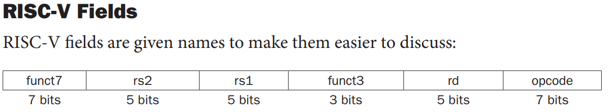

# ALU Control

No laboratório anterior nós aprendemos a contruir uma Unidade Lógica e Aritmética compatível com as instruções RISC-V. Ela recebe um sinal `ALU_OP_i` indicando qual operação deve ser realizada e entrega na saída o resultado. Apesar de já ser um componete bastante útil, ainda é preciso adicionar uma parte fundamental: a lógica de controle.

Esse bloco é responsável por interagir com o restante do processador para poder identificar automaticamente qual operação deve ser feita na ALU. Sem ele, o controle da ALU teria que ser feito manualmente, algo completamente inviável para um processador que a princípio seria capaz de executar várias instruções por segundo.

Mas antes de explicar como funcina esse bloco de controle, é preciso apresentar as diferentes instruções presentes na ISA RISC-V e como a operação da ALU correspondente é encontrada a partir delas.

## Formato das instruções RISC-V

Antes de começar a explicar sobre as instruções, devo indicar o livro referência para que você possa fazer uma leitura mais detalhada do assunto, caso tenha interesse. Este laboratório tem como base o livro [Digital Design and Computer Architecture, Risc-V Edition](https://www.google.com.br/books/edition/Digital_Design_and_Computer_Architecture/SksiEAAAQBAJ), por Harris e Harris.

Agora que já foram feitas as devidas apresentações, vamos começar. Já sabemos que o processador pode realizar diversas operações diferentes, desde uma soma até deslocamentos de bits e comparações entre números. Também sabemos que o que indica para o processador o que ele deve fazer são as instruções. Mas afinal, o que são as instruções?

Instruções, no contexto do nosso processador RISC-V, são palavras de 32 bits que são colocadas na entrada do processador para que ele possa lê-las. Toda a informação necessária para o processador realizar a sua operação está contida nos campos da instrução. Vejamos um exemplo de instrução, analizando as suas diferentes partes.



>Nota: os bits são lidos da direita para a esquerda, ou seja, opcode = inst[6:0] e funct7 = inst[31:25]

- Opcode: identificador principal da operação e do formato da instrução (mais sobre o formato a seguir)
- funct3 e funct7: campos adicionais do opcode que identificam a operação
- rd, rs1 e rs2: registradores envolvidos na operação

Portanto, como podemos ver, os campos opcode, funct3 e funt7 são necessários para que o processador consiga identificar qual operação deve ser realizada.

Essa distribuição de campos, no entanto, não é a única que existe para as instruções RISC-V. As instruções RISC-V podem ser agrupadas como do tipo R (presente na imagem anterior), I, S, B, U e J. Veja na figura abaixo.


O campo imm se refere ao imediato, um valor absoluto que é utilizado diretamente pelo processador.

Para uma lista completa da codificação de todas as instruções (usaremos apenas as instruções do subconjunto RV32I), você pode acessar diretamente o [manual oficial da ISA RISC-V](https://drive.google.com/file/d/1uviu1nH-tScFfgrovvFCrj7Omv8tFtkp/view). A lista está na página 609, Capítulo 35 "RV32/64G Instruction Set Listings".

São vários formatos de instruções diferentes, não é? Para ficar mais fácil de identificar todas essas possíveis instruções, pode ser feita uma simplificação, que será apresentada a seguir.

## Agrupando as Instruções

Uma forma de enxergar melhor os diferentes tipos de instruções é agrupá-las em três categorias: operações de LOAD/STORE, de BRANCH e de ALU.

- LOAD/STORE: a ALU sempre faz uma soma para calcular o endereço
- BRANCH: a ALU faz algum tipo de comparação, definida pelo campo funct3
- ALU: a ALU faz operações variadas, podendo ser XOR, SHIFT, etc. A operação a ser realizada depende tanto do funct3 quanto do funct7


Exceção:

As instruções ADDI, SUB e ADD, todas do grupo ALU, dependem do opcode e do funct7 para serem diferenciadas.

Instrução   |  Opcode   | funct3 | funct7 | Operação ALU |
|-----------|-----------|--------|--------|--------------|
|ADD        | 0110011   |  000   | 0000000| Soma         |
|ADDI       | 0010011   |  000   | -      | Soma         |
|SUB        | 0110011   |  000   | 0100000| Subtração    |


## O decodificador da ALU

O bloco a ser desenvolvido é o decodificador da ALU, aqui nomeado `alu_control`. Ele possui a seguinte interface:

```verilog
module ALU_Control (
    input wire is_immediate_i,
    input wire [1:0] ALU_CO_i,
    input wire [6:0] FUNC7_i,
    input wire [2:0] FUNC3_i,
    output reg [3:0] ALU_OP_o
);
```

- `is_immediate_i` é uma entrada que possui o bit 5 do opcode, usado para diferenciar as instruções ADD e ADDI, por exemplo.
- `ALU_CO_i` é uma entrada que indica a qual grupo aquela instrução pertence

| ALU_CO_i | Grupo      |
|--------- |----------- |
|00        | LOAD/STORE |
|01        | BRANCH     |
|10        | ALU        |
|11        | Inválido   |

- `FUNC7_i` e `FUNC3_i` são os campos funct3 e funct7 da instrução
- `ALU_OP_o` é o sinal que vai para a ALU e seleciona a sua operação. Os valores de ALU_OP_o foram reescritos na tabela abaixo:

| Operação              |  Opcode    |
| --------------------- |  --------- |
| `AND`                 |  `4'b0000` |
| `OR`                  |  `4'b0001` |
| `XOR`                 |  `4'b1000` |
| `NOR`                 |  `4'b1001` |
| `SUM`                 |  `4'b0010` |
| `SUB`                 |  `4'b1010` |
| `EQUAL`               |  `4'b0011` |
| `GREATER_EQUAL`       |  `4'b1100` |
| `GREATER_EQUAL_U`     |  `4'b1101` |
| `SLT` (Set Less Than) |  `4'b1110` |
| `SLT_U`               |  `4'b1111` |
| `SHIFT_LEFT`          |  `4'b0100` |
| `SHIFT_RIGHT`         |  `4'b0101` |
| `SHIFT_RIGHT_A`       |  `4'b0111` |

## Execução da atividade

Siga o modelo de módulo já fornecido e utilize o testbench e scripts de execução para sua verificação. Em seguida, implemente o circuito de acordo com as especificações e, se necessário, crie outros testes para verificá-lo.

Uma vez que estiver satisfeito com o seu código, execute o script de testes com `./run-all.sh`. Ele mostrará na tela `ERRO` em caso de falha ou `OK` em caso de sucesso.

## Entrega

Realize um *commit* no repositório do **GitHub Classroom**. O sistema de correção automática irá validar sua implementação e atribuir uma nota com base nos testes.

> **Dica:**  
Não altere os arquivos de correção! Para entender como os testes funcionam, consulte o script `run.sh` disponível no repositório.